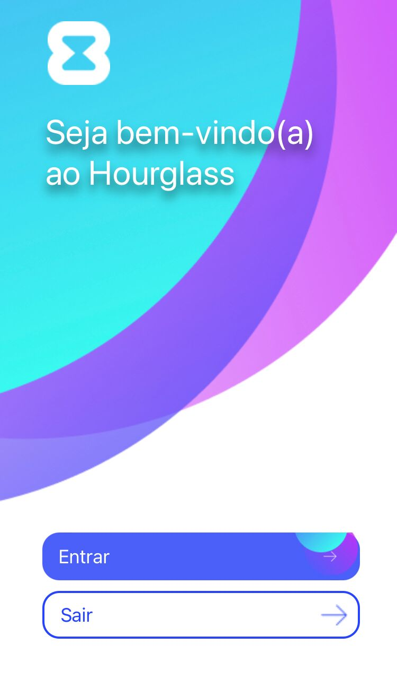

# Hourglass

O Hourglass foi o aplicativo desenvolvido para disciplina de C317. 

O Hourglass foi criado com o intuito de diminuir a Uberização do Trabalho. O conceito de uberização do trabalho pode ser definido como um novo modelo de trabalho, que, na teoria, se coloca como mais flexível, no qual o profissional presta serviços conforme a demanda e sem que haja vínculo empregatício. 

Exemplo disso são os motoristas de aplicativos, que prestam serviços para determinadas plataformas, mas sem que haja uma regulamentação efetiva e que garanta os seus direitos trabalhistas.

Esse modelo de trabalho é defendido por algumas empresas, especialmente as de tecnologia. O argumento é que ele oferece mais flexibilidade para ambas as partes. Nesse contexto, o profissional seria “o seu próprio chefe” e responsável pelo gerenciamento do seu tempo (ou seja, ele é quem define quantas horas irá trabalhar).

Porém essa flexibilidade faz com que esses profissionais trabalhem em jornadas exaustivas para que recebam o mesmo valor que receberiam efetivados ocasionando acidentes, falta de informações sobre contruições e etc.

<p align="center"></p>

### Ambiente necessário para execução

- [Git](https://git-scm.com)
- [Node.js](https://nodejs.org/en/)
- [VSCode](https://code.visualstudio.com/)
- [Expo](https://expo.dev/)

### 🚀 Como executar

- Clone este repositório
```
https://github.com/mairaalvs/C317.git
```

- Abra o terminal na pasta do projeto e instale suas dependências:
```
npm install
```

- No terminal do Visual Studio Code rode o projeto:
```
expo start
```

No terminal aparecerá um QR Code, através do aplicativo Expo Go instalado no seu celular leia o QR Code para que o aplicativo rode em seu celular. 

